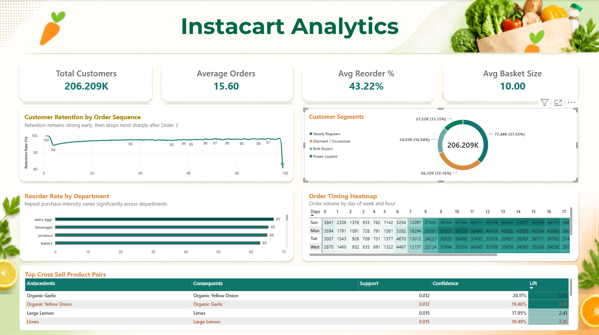

# Instacart Customer Retention & Reorder Behavior Analysis

**End-to-end product/data analytics project** — from raw transactional data to an executive Power BI dashboard and actionable business recommendations.

This project is designed to mirror a real analytics engagement: start with a business question, structure and validate the data, analyze customer behavior, and finish with a stakeholder-ready dashboard and recommendations.

📊 [**View the Power BI Dashboard**](dashboard/Instacart.pbix) · 📄 [**Read the Full Insights Report**](docs/Insights_and_Recommendations.docx) · 📋 [**Business Requirements**](docs/01_business_requirements.md) · 💼 [**LinkedIn**](https://www.linkedin.com/in/ayaan-gavandi-a16202218/) · 💻 [**GitHub**](https://github.com/ayaangavandi)

---

## Business Problem

> *"Why do some customers keep ordering while others drop off — and which products or behaviors predict long-term retention?"*

Instacart's repeat-purchase model makes customer retention and reorder behavior important levers for growth. Using **3.2M+ historical orders from 206,209 customers**, this project identifies:

- where customer retention drops most sharply
- which departments have the strongest repeat-purchase behavior
- how customers differ behaviorally
- when customers are most likely to place orders
- which products are most strongly associated with being purchased together

The findings are translated into targeted, practical recommendations for retention, lifecycle marketing, operations, and cross-sell opportunities.

---

## Tech Stack

| Stage | Tool |
|---|---|
| Data storage & querying | MySQL |
| Analysis & modeling | Python (pandas, scikit-learn, mlxtend) |
| Dashboard | Power BI |
| Documentation | Markdown, Word |

---

## Workflow

```text
Raw CSVs (Kaggle)
   │
   ▼
MySQL database
(schema + loading + data quality checks)
   │
   ▼
SQL exploratory analysis
(retention, timing, reorder behavior)
   │
   ▼
Python
(customer segmentation + market basket analysis)
   │
   ▼
Power BI
(one-page executive dashboard)
   │
   ▼
Insights & Recommendations
```

---

## Dashboard

### Executive Dashboard

[**Open the Power BI Dashboard (.pbix)**](dashboard/Instacart.pbix)



The one-page executive view focuses on:

- Customer retention by order sequence
- Customer behavioral segments
- Reorder rate by department
- Order timing by day and hour
- Top cross-sell product pairs
- Core customer behavior KPIs

---

## Key Findings

| # | Finding |
|---|---|
| **1** | **Retention cliff at Order 3→4:** retention drops from **95.8% to 88.6%**, a **7.16 percentage-point decline** and the steepest consecutive-order drop observed in the retention curve. |
| **2** | **Category loyalty gap:** **Dairy & Eggs leads reorder behavior at 67.0%**, while **Personal Care is lowest at 32.1%**, showing substantial variation in repeat-purchase behavior across departments. |
| **3** | **Four distinct behavioral segments:** **Steady Regulars (37.6%)**, **Dormant/Occasional (32.2%)**, **Bulk Buyers (16.9%)**, and **Power Loyalists (13.3%)** exhibit meaningfully different purchase patterns and should be approached differently. |
| **4** | **Predictable ordering rhythm:** customers show an approximately **7-day median gap between orders**, with clear day/hour concentration that can support reminder timing and operational planning. |
| **5** | **Cross-sell signal:** **Organic Yellow Onion ↔ Organic Garlic** has the strongest observed association at **3.35× lift**, followed by **Large Lemon ↔ Limes at 2.41×**. |

---

## Customer Segments

The clustering analysis identified four behaviorally distinct customer groups:

| Segment | Share | Behavioral profile |
|---|---:|---|
| **Steady Regulars** | **37.6%** | Largest group; consistent ordering behavior with moderate basket size and reorder rate. |
| **Dormant / Occasional** | **32.2%** | Lowest engagement, longest gaps between orders, and lowest reorder rate; clearest retention opportunity. |
| **Bulk Buyers** | **16.9%** | Larger baskets and high item volume, but less frequent ordering. |
| **Power Loyalists** | **13.3%** | Highest order frequency, highest reorder rate, and highest overall purchasing volume. |

---

## Operational Signals

### Peak ordering window

The strongest day/hour combination in the analyzed order-timing data is:

**Monday at 10 AM — 54,719 orders**

Other high-volume periods include Sunday afternoon, while overnight windows have substantially lower order volume.

These patterns can support better timing for customer reminders, staffing, and inventory replenishment.

---

## Cross-Sell Signals

The strongest association rules in the analysis include:

| Product Pair | Support | Confidence | Lift |
|---|---:|---:|---:|
| Organic Yellow Onion ↔ Organic Garlic | 1.17% | ~19–20% | **3.35×** |
| Large Lemon ↔ Limes | 1.45% | ~18–19% | **2.41×** |
| Organic Lemon ↔ Organic Hass Avocado | 1.12% | ~10–24% | **2.14×** |
| Organic Strawberries ↔ Organic Raspberries | 1.79% | ~13–25% | **1.77×** |

The rules are directional, so both directions can appear in the association output. For executive reporting, these are best interpreted as **product-pair relationships**, not separate opportunities.

---

## Recommendations

### 1. Target the Order 3→4 retention cliff

Trigger a targeted retention touchpoint before the customer's fourth-order window, such as a reminder, personalized message, or carefully tested incentive.

**Why:** This directly targets the single largest observed retention drop rather than applying broad, untargeted retention spend.

### 2. Promote high-reorder departments

Feature strong repeat-purchase categories such as **Dairy & Eggs, Beverages, and Produce** in subscribe-and-save or auto-reorder prompts.

**Why:** These categories already demonstrate strong repeat behavior.

### 3. Build segment-specific lifecycle campaigns

- **Power Loyalists:** loyalty perks, referrals, and advocacy
- **Steady Regulars:** convenience and repeat-order nudges
- **Bulk Buyers:** bulk savings and bundle-oriented offers
- **Dormant / Occasional:** win-back and reactivation campaigns

**Why:** Behavioral targeting is more actionable than a one-size-fits-all customer strategy.

### 4. Align communications and operations to ordering peaks

Use observed day/hour patterns to time push notifications and inform staffing and inventory planning.

**Why:** Messaging and operational capacity can be aligned with actual customer demand.

### 5. Surface high-affinity product pairs

Use "frequently bought together" prompts for strong associations such as **Organic Yellow Onion + Organic Garlic** and **Large Lemon + Limes**.

**Why:** This creates a low-cost cross-sell opportunity using observed purchase behavior.

---

## Data Limitations

These limitations are intentionally disclosed because they materially affect how the findings should be interpreted.

- **No revenue, pricing, margin, or demographic data:** impact estimates are behavioral/directional rather than dollarized and should be validated with financial data before investment decisions.
- **Selection bias:** the available customer history is focused on customers with at least 4 historical orders, so this analysis cannot measure true first-order or second-order churn.
- **Top-coding:** `days_since_prior_order` is capped at 30 days, so longer real-world gaps are understated.
- **Sparse tail behavior:** the apparent decline near order #100 occurs among very few customers and should not be treated as a meaningful lifecycle signal.
- **Association rules are behavioral signals:** lift identifies stronger-than-expected co-occurrence, but it does not establish causality.

---

## Reproducing the Project

1. `sql/01_schema_mysql.sql` → create the MySQL schema
2. `sql/02_load_data_mysql.sql` → load the Kaggle CSVs
3. `sql/03_data_quality_checks.sql` → verify data integrity
4. `sql/04_eda_phase3.sql` → run exploratory analysis
5. `sql/05_phase4_exports.sql` → export customer and basket features for Python
6. `notebooks/phase4a_customer_segmentation.py` → run customer segmentation
7. `notebooks/phase4b_basket_analysis.py` → run market basket analysis
8. Open `dashboard/Instacart.pbix` in Power BI Desktop, or rebuild the report using `docs/04_powerbi_build_guide.md`

---

## Repository Structure

```text
├── docs/
│   ├── 01_business_requirements.md
│   ├── 02_data_quality_report.md
│   ├── 03_metrics_dictionary.md
│   ├── 04_powerbi_build_guide.md
│   └── Insights_and_Recommendations.docx
│
├── sql/
│   ├── 01_schema_mysql.sql
│   ├── 02_load_data_mysql.sql
│   ├── 03_data_quality_checks.sql
│   ├── 04_eda_phase3.sql
│   └── 05_phase4_exports.sql
│
├── notebooks/
│   ├── phase4a_customer_segmentation.py
│   └── phase4b_basket_analysis.py
│
├── outputs/
│   └── summary CSVs and analysis outputs
│
├── dashboard/
│   └── instacart_dashboard.pbix
│
├── assets/
│   └── dashboard_screenshot.png
│
└── data/
    └── raw Kaggle CSVs (gitignored)
```

---

## Getting the Data

The raw Kaggle files are not committed to this repository because they are large and are not mine to redistribute.

Download the **Instacart Market Basket Analysis** dataset from Kaggle:

https://www.kaggle.com/c/instacart-market-basket-analysis/data

Place the six raw CSV files in:

```text
data/
```

Then run the SQL loading steps described above.

---

## Documentation

More detailed project documentation is available in:

- [`01_business_requirements.md`](docs/01_business_requirements.md)
- [`02_data_quality_report.md`](docs/02_data_quality_report.md)
- [`03_metrics_dictionary.md`](docs/03_metrics_dictionary.md)
- [`04_powerbi_build_guide.md`](docs/04_powerbi_build_guide.md)
- [`Insights_and_Recommendations.docx`](docs/Insights_and_Recommendations.docx)

---

## Author

**Ayaan Gavandi** — Aspiring Product / Data Analyst

📧 `your.email@example.com`  
🔗 [LinkedIn](https://www.linkedin.com/in/ayaan-gavandi-a16202218/)  
💻 [GitHub](https://github.com/ayaangavandi)
